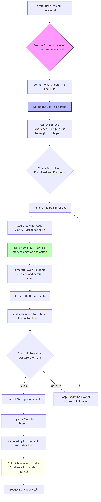

# Product_design_thinking
---

### Ship MVPs Faster with High-Quality Prototypes — Without Design Bottlenecks

---

##  What You Get

- ✅ Clean, modern **UI mockups** aligned to strong UX principles  
- ✅ Seamless **user flows** that feel intuitive and intentional  
- ✅ Fully interactive **prototypes** you can test, validate, or pitch

From idea → polished prototype **in hours**, not weeks.

---

##  Why Use This?

Skip slow cycles of wireframes, reviews, and redesigns.  
This system turns your product idea into a **world-class prototype** ready for user testing or MVP validation — with minimal input, and no design overhead.

---

##  Perfect For

- Founders & PMs needing to test fast
- Builders launching new MVPs
- Startups short on time, not taste
- Product teams validating multiple ideas
- Anyone wanting *real user feedback* on *real-feeling products*

---

##  Outputs 

- ✅ A clear UX flow (only if needed)
- ✅ High-fidelity UI mockups and full flow
- ✅ Clickable prototype (Vue / React / Next )

---

##  Use Cases

- Pitch to investors with confidence
- Run real user tests before you build
- Cut idea-to-test time by 90%
- Get buy-in across teams with a real-feeling concept
- De-risk engineering cycles

---

## 🛑 You Don’t Need

- A full design team  
- Design tools or files  
- Endless review cycles  
- A pixel-perfect spec

---

## 📬 Ready to Go?

if youre interested in detials/how it works/collaboration DM me. 
 

